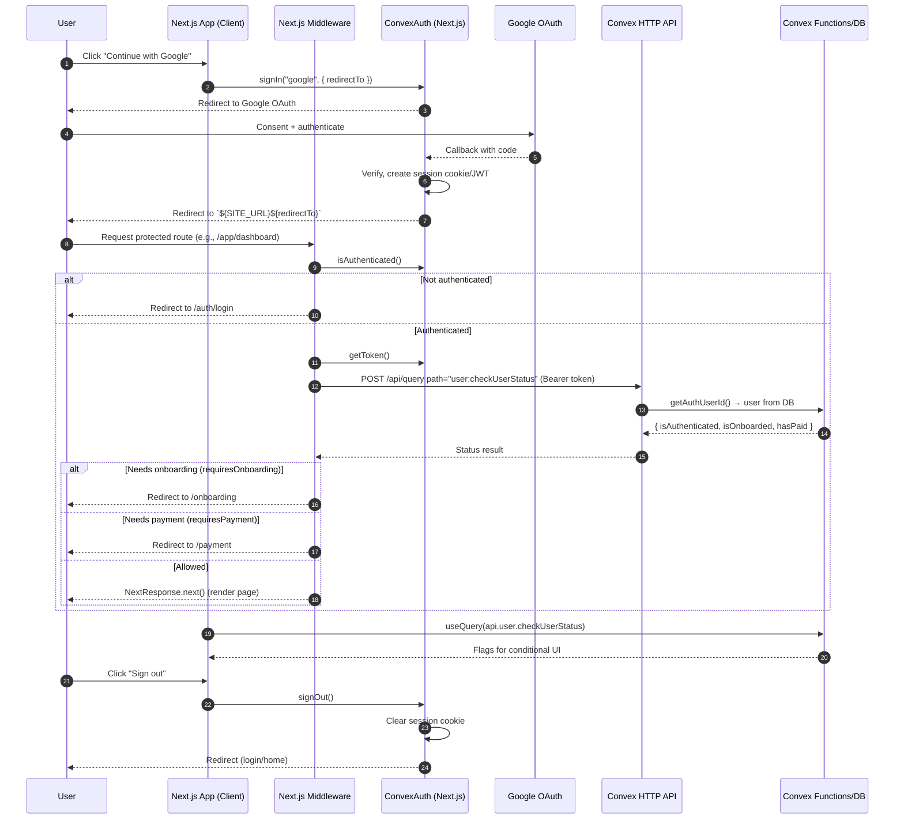

# Authentication Flow

This app uses Convex Auth (Auth.js under the hood) with Google as the OAuth provider, integrated into Next.js via `@convex-dev/auth`. Middleware gates protected routes and verifies onboarding/payment status via Convex queries.

## Key Components
- `convex/auth.ts`: Sets up Convex Auth with Google and a `redirect` callback building `${SITE_URL}${redirectTo}`.
- `src/app/layout.tsx`: Wraps the app with `ConvexAuthNextjsServerProvider` and the client with `ConvexAuthNextjsProvider` (via `ConvexClientProvider`).
- `src/app/auth/login/page.tsx`: Login screen that renders `SignInWithGoogle`.
- `src/app/auth/login/SignInWithGoogle.tsx`: Calls `useAuthActions().signIn("google", { redirectTo })`.
- `src/middleware.ts`: Uses `convexAuthNextjsMiddleware` to protect routes, check auth, fetch Convex token, and verify onboarding/payment via `user:checkUserStatus`.
- `src/lib/routes.ts`: Central route config flags: `isPublic`, `requiresAuth`, `requiresOnboarding`, `requiresPayment`.
- `convex/core/users/queries.ts`: `checkUserStatus` and `isUserOnboarded` queries used by middleware/UI.
- `src/components/auth/LogoutButton.tsx`: Calls `useAuthActions().signOut()` to end the session.

## Sequence Diagram (Mermaid)

## Route Gating Logic
- Public routes: Allowed without auth per `getPublicRoutes()` in `src/lib/routes.ts`.
- Protected routes: Require `isAuthenticated` (checked in middleware via `convexAuth.isAuthenticated()`).
- Onboarding: If `requiresOnboarding` and `!isOnboarded`, redirect to `/onboarding`.
- Payment: If `requiresPayment` and `!hasPaid`, redirect to `/payment`.
- Special case: `/app/dashboard` allows immediate access when `?payment=success&paymentId=...` is present to give Stripe webhook time to update user status.

## Environment Variables
- `SITE_URL`: Base site URL used for post-auth redirects.
- `NEXT_PUBLIC_CONVEX_URL`: Convex deployment URL for the browser client and middleware HTTP calls.
- `CONVEX_SITE_URL`: Domain used by Convex Auth config (`convex/auth.config.ts`).
- `AUTH_GOOGLE_ID` / `AUTH_GOOGLE_SECRET`: Google OAuth credentials for Auth.js (Convex Auth).
- Google Calendar integration also uses `CONVEX_URL`, `GOOGLE_CLIENT_ID`, `GOOGLE_CLIENT_SECRET` (separate from sign-in).

## File References

- src/app/layout.tsx:1
- src/app/ConvexClientProvider.tsx:1
- src/app/auth/login/page.tsx:1
- src/app/auth/login/SignInWithGoogle.tsx:1
- src/middleware.ts:1
- src/lib/routes.ts:1
- convex/core/users/queries.ts:1
- src/components/auth/LogoutButton.tsx:1

