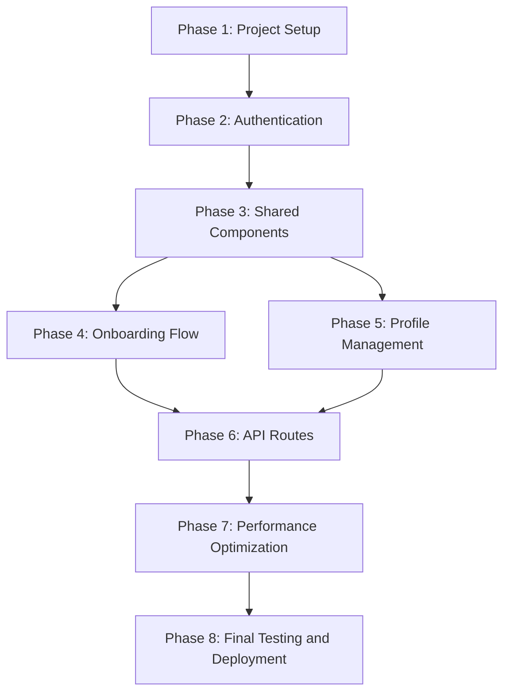

# Next.js 13 Migration Plan with Integrated Testing Strategy

## Table of Contents

- [1. Executive Summary](#1-executive-summary)
- [2. Migration Overview](#2-migration-overview)
- [3. Phase 1: Project Setup and Configuration](#3-phase-1-project-setup-and-configuration)
- [4. Phase 2: Authentication System Migration](#4-phase-2-authentication-system-migration)
- [5. Phase 3: Shared Components Migration](#5-phase-3-shared-components-migration)
- [6. Phase 4: Onboarding Flow Migration](#6-phase-4-onboarding-flow-migration)
- [7. Phase 5: Profile Management Migration](#7-phase-5-profile-management-migration)
- [8. Phase 6: API Routes Migration](#8-phase-6-api-routes-migration)
- [9. Phase 7: Performance Optimization](#9-phase-7-performance-optimization)
- [10. Phase 8: Final Testing and Deployment](#10-phase-8-final-testing-and-deployment)
- [11. Critical Path Analysis](#11-critical-path-analysis)
- [12. Risk Assessment and Mitigation](#12-risk-assessment-and-mitigation)
- [13. Rollback Strategy](#13-rollback-strategy)
- [14. Appendix: Testing Frameworks and Tools](#14-appendix-testing-frameworks-and-tools)

## 1. Executive Summary

This document outlines a comprehensive plan for migrating the existing React application to Next.js 13 with App Router architecture. The migration will be performed incrementally, with each phase having specific success criteria, testing procedures, and recovery strategies. The plan focuses on maintaining application functionality throughout the migration while leveraging the benefits of Next.js 13, including server components, improved routing, and enhanced performance.

### Key Objectives

- Migrate the application to Next.js 13 with App Router architecture
- Implement server components for improved performance
- Enhance the integration between onboarding and profile management
- Establish comprehensive testing procedures for each migration phase
- Ensure zero downtime during the migration process

### Timeline Overview

| Phase | Description | Estimated Duration |
|-------|-------------|-------------------|
| 1 | Project Setup and Configuration | 1 week |
| 2 | Authentication System Migration | 1 week |
| 3 | Shared Components Migration | 2 weeks |
| 4 | Onboarding Flow Migration | 2 weeks |
| 5 | Profile Management Migration | 2 weeks |
| 6 | API Routes Migration | 1 week |
| 7 | Performance Optimization | 1 week |
| 8 | Final Testing and Deployment | 1 week |

**Total Estimated Duration: 11 weeks**

## 2. Migration Overview

### Current Architecture

The existing application is built with React and uses:
- React Router for navigation
- Supabase for authentication and database
- Client-side rendering for most components
- Local state management with React hooks

### Target Architecture

The migrated application will use Next.js 13 with:
- App Router for file-based routing
- Server Components for improved performance
- Supabase Auth Helpers for Next.js
- Hybrid rendering (SSR, ISR, and CSR as appropriate)
- Enhanced integration between onboarding and profile management

### Migration Strategy

The migration will follow an incremental approach:
1. Set up Next.js alongside the existing React app
2. Migrate components and pages one by one
3. Test each migrated component independently
4. Gradually phase out the original React components

## 3. Phase 1: Project Setup and Configuration

### Objectives

- Set up Next.js 13 project structure
- Configure Tailwind CSS
- Set up testing frameworks (Jest, React Testing Library, Playwright)
- Configure Supabase integration for Next.js

### Tasks

1. **Initialize Next.js Project**
   - Create Next.js 13 project with App Router
   - Configure TypeScript
   - Set up ESLint and Prettier

2. **Configure Styling**
   - Install and configure Tailwind CSS
   - Migrate global styles
   - Set up theme configuration

3. **Set Up Testing Frameworks**
   - Install and configure Jest and React Testing Library
   - Set up Playwright for E2E testing
   - Create test utilities and mocks

4. **Configure Supabase Integration**
   - Install Supabase Auth Helpers for Next.js
   - Set up server and client Supabase clients
   - Configure environment variables

### Success Criteria

- Next.js 13 project successfully initialized with App Router
- Tailwind CSS correctly configured and working
- Testing frameworks installed and passing sample tests
- Supabase integration configured and authenticated connection established

### Testing Procedures

#### Automated Tests

```typescript
// Test Next.js configuration
test('Next.js is properly configured', async () => {
  const response = await fetch('http://localhost:3000');
  expect(response.status).toBe(200);
});

// Test Tailwind CSS configuration
test('Tailwind CSS is properly configured', () => {
  const { getByText } = render(<div className="text-blue-500">Blue Text</div>);
  const element = getByText('Blue Text');
  expect(window.getComputedStyle(element).color).toBe('rgb(59, 130, 246)');
});

// Test Supabase connection
test('Supabase connection is established', async () => {
  const supabase = createClientClient();
  const { error } = await supabase.auth.getSession();
  expect(error).toBeNull();
});
```

#### Manual Tests

1. Verify Next.js dev server starts without errors
2. Confirm hot reloading works correctly
3. Verify Tailwind classes are applied correctly
4. Test Supabase connection through browser console

### Potential Failure Points and Recovery

| Failure Point | Symptoms | Recovery Strategy |
|---------------|----------|-------------------|
| Next.js configuration issues | Build errors, runtime errors | Review configuration files, check Next.js documentation, ensure compatibility with dependencies |
| Tailwind CSS integration problems | Styles not applying, CSS conflicts | Verify PostCSS configuration, check for conflicting CSS libraries, ensure proper class usage |
| Supabase connection failures | Authentication errors, database query failures | Verify environment variables, check Supabase service status, review authentication configuration |
| Testing framework configuration issues | Tests failing to run, false positives/negatives | Review Jest/Playwright configuration, update mocks, ensure proper test isolation |

## 4. Phase 2: Authentication System Migration

### Objectives

- Migrate authentication flow to Next.js
- Implement Supabase Auth Helpers for Next.js
- Create authentication middleware
- Implement protected routes

### Tasks

1. **Implement Authentication Middleware**
   - Create middleware.ts for route protection
   - Configure session handling
   - Set up redirects for unauthenticated users

2. **Migrate Login and Registration Pages**
   - Create app/(auth)/login/page.tsx
   - Create app/(auth)/register/page.tsx
   - Implement form components with validation

3. **Implement Auth Callback Handler**
   - Create app/api/auth/callback/route.ts
   - Handle OAuth redirects
   - Implement session exchange

4. **Create Authentication Hooks**
   - Migrate useAuth hook to Next.js
   - Implement session persistence
   - Add sign-in, sign-out, and registration functions

### Success Criteria

- Users can sign up, log in, and log out
- Protected routes redirect unauthenticated users to login
- Authentication state persists across page refreshes
- OAuth providers work correctly

### Dependencies

- Phase 1 must be completed successfully

### Testing Procedures

#### Unit Tests

```typescript
// Test authentication middleware
test('middleware redirects unauthenticated users', async () => {
  const req = new Request('http://localhost:3000/profile');
  const res = await middleware(req);
  expect(res.status).toBe(307);
  expect(res.headers.get('Location')).toContain('/login');
});

// Test authentication hooks
test('useAuth provides authentication state', async () => {
  const { result, waitForNextUpdate } = renderHook(() => useAuth());
  
  expect(result.current.isLoading).toBe(true);
  expect(result.current.isAuthenticated).toBe(false);
  
  await waitForNextUpdate();
  
  expect(result.current.isLoading).toBe(false);
});
```

#### E2E Tests

```typescript
// Test login flow
test('user can log in', async ({ page }) => {
  await page.goto('/login');
  await page.fill('input[name="email"]', 'test@example.com');
  await page.fill('input[name="password"]', 'password');
  await page.click('button[type="submit"]');
  
  await page.waitForURL('**/dashboard');
  expect(page.url()).toContain('/dashboard');
});

// Test protected routes
test('unauthenticated users are redirected from protected routes', async ({ page }) => {
  await page.goto('/profile');
  await page.waitForURL('**/login');
  expect(page.url()).toContain('/login');
});
```

#### Manual Tests

1. Complete login flow with valid credentials
2. Attempt login with invalid credentials
3. Register new account
4. Verify session persistence after page refresh
5. Test OAuth providers (Google, GitHub, etc.)
6. Verify protected routes redirect to login

### Potential Failure Points and Recovery

| Failure Point | Symptoms | Recovery Strategy |
|---------------|----------|-------------------|
| Session persistence issues | Users logged out unexpectedly | Review cookie configuration, check Supabase session handling, verify middleware implementation |
| OAuth integration problems | OAuth login failures, redirect issues | Check callback URL configuration, verify provider settings in Supabase dashboard |
| CSRF protection failures | Security warnings, login failures | Review CSRF token implementation, ensure proper form submission |
| Middleware configuration issues | Incorrect redirects, protected routes accessible | Review middleware matcher configuration, check session validation logic |

## 5. Phase 3: Shared Components Migration

### Objectives

- Migrate UI components to Next.js
- Implement client and server component patterns
- Ensure component reusability
- Set up component testing

### Tasks

1. **Migrate Basic UI Components**
   - Button, Input, Card, etc.
   - Implement as client components
   - Ensure Tailwind CSS integration

2. **Migrate Layout Components**
   - Header, Footer, Sidebar
   - Create app/layout.tsx
   - Implement responsive layouts

3. **Implement Form Components**
   - Form wrappers
   - Input validation
   - Error handling

4. **Create Component Testing Suite**
   - Unit tests for each component
   - Visual regression tests
   - Accessibility tests

### Success Criteria

- All shared components successfully migrated
- Components render correctly in both client and server contexts
- Component tests pass with >90% coverage
- Components maintain visual consistency with original design

### Dependencies

- Phase 1 must be completed successfully

### Testing Procedures

#### Unit Tests

```typescript
// Test button component
test('Button renders correctly', () => {
  const { getByRole } = render(<Button>Click me</Button>);
  const button = getByRole('button');
  expect(button).toHaveTextContent('Click me');
});

// Test input component
test('Input handles changes', () => {
  const handleChange = jest.fn();
  const { getByRole } = render(<Input onChange={handleChange} />);
  const input = getByRole('textbox');
  
  fireEvent.change(input, { target: { value: 'test' } });
  expect(handleChange).toHaveBeenCalled();
});
```

#### Visual Tests

```typescript
// Visual regression test
test('Card component matches snapshot', () => {
  const { container } = render(
    <Card>
      <Card.Header>Header</Card.Header>
      <Card.Body>Content</Card.Body>
      <Card.Footer>Footer</Card.Footer>
    </Card>
  );
  
  expect(container).toMatchSnapshot();
});
```

#### Accessibility Tests

```typescript
// Accessibility test
test('Button is accessible', () => {
  const { container } = render(<Button>Click me</Button>);
  const results = axe(container);
  expect(results).toHaveNoViolations();
});
```

#### Manual Tests

1. Verify components render correctly in different browsers
2. Test responsive behavior on different screen sizes
3. Verify keyboard navigation works correctly
4. Check color contrast for accessibility
5. Test component interactions (hover, focus, click)

### Potential Failure Points and Recovery

| Failure Point | Symptoms | Recovery Strategy |
|---------------|----------|-------------------|
| Client/server component confusion | Hydration errors, "useState can only be used in Client Components" errors | Review component usage, add "use client" directive where needed, ensure proper component separation |
| Style inconsistencies | Visual differences between original and migrated components | Review Tailwind configuration, check for missing styles, ensure proper class application |
| Accessibility issues | Screen reader problems, keyboard navigation issues | Run accessibility audits, fix ARIA attributes, ensure proper focus management |
| Component performance issues | Slow rendering, layout shifts | Profile component rendering, optimize re-renders, implement proper memoization |

## 6. Phase 4: Onboarding Flow Migration

### Objectives

- Migrate onboarding wizard to Next.js
- Implement server component for initial data loading
- Create client components for interactive steps
- Integrate with profile management

### Tasks

1. **Create Onboarding Page Structure**
   - Implement app/onboarding/page.tsx as server component
   - Create layout and loading states
   - Set up route protection

2. **Migrate Onboarding Wizard**
   - Convert OnboardingWizard to client component
   - Migrate step components
   - Implement state management

3. **Implement Data Persistence**
   - Save onboarding data to localStorage
   - Implement API endpoint for saving to database
   - Connect to profile data

4. **Create Onboarding Tests**
   - Unit tests for components
   - Integration tests for data flow
   - E2E tests for complete onboarding process

### Success Criteria

- Onboarding flow works end-to-end
- Data is correctly saved to both localStorage and database
- Users can complete onboarding and proceed to dashboard
- All tests pass with >90% coverage

### Dependencies

- Phase 2 (Authentication) must be completed
- Phase 3 (Shared Components) must be completed

### Testing Procedures

#### Unit Tests

```typescript
// Test onboarding step component
test('PurposeStep handles selection', () => {
  const handleChange = jest.fn();
  const { getByText } = render(
    <PurposeStep value={null} onChange={handleChange} />
  );
  
  fireEvent.click(getByText("I'd love help with planning my day."));
  expect(handleChange).toHaveBeenCalledWith('planning');
});

// Test onboarding data persistence
test('OnboardingWizard saves data to localStorage', () => {
  const { getByText } = render(<OnboardingWizard />);
  
  // Complete first step
  fireEvent.click(getByText("I'd love help with planning my day."));
  fireEvent.click(getByText("Continue"));
  
  // Check localStorage
  const savedData = JSON.parse(localStorage.getItem('alara-onboarding-data'));
  expect(savedData.purpose).toBe('planning');
});
```

#### Integration Tests

```typescript
// Test onboarding to profile connection
test('Onboarding data is saved to profile', async () => {
  const mockSupabase = {
    from: jest.fn().mockReturnValue({
      upsert: jest.fn().mockReturnValue({
        select: jest.fn().mockResolvedValue({ data: { id: '123' }, error: null })
      })
    })
  };
  
  const { getByText } = render(
    <SupabaseProvider value={mockSupabase}>
      <SummaryStep 
        data={{ 
          purpose: 'planning',
          supportType: ['focus'],
          phoneNumber: '1234567890',
          completed: true
        }} 
        onStartSubscription={jest.fn()}
      />
    </SupabaseProvider>
  );
  
  fireEvent.click(getByText('Start My Alara Journey'));
  
  await waitFor(() => {
    expect(mockSupabase.from).toHaveBeenCalledWith('profiles');
    expect(mockSupabase.from().upsert).toHaveBeenCalled();
  });
});
```

#### E2E Tests

```typescript
// Test complete onboarding flow
test('User can complete onboarding process', async ({ page }) => {
  // Log in first
  await page.goto('/login');
  await page.fill('input[name="email"]', 'test@example.com');
  await page.fill('input[name="password"]', 'password');
  await page.click('button[type="submit"]');
  
  // Should redirect to onboarding
  await page.waitForURL('**/onboarding');
  
  // Complete each step
  await page.click('text="I\'d love help with planning my day."');
  await page.click('button:has-text("Continue")');
  
  // Continue with other steps...
  
  // Final step
  await page.click('button:has-text("Start My Alara Journey")');
  
  // Should redirect to dashboard
  await page.waitForURL('**/dashboard');
  expect(page.url()).toContain('/dashboard');
});
```

#### Manual Tests

1. Complete entire onboarding flow as a new user
2. Test saving and resuming onboarding progress
3. Verify data persistence after completing onboarding
4. Test navigation between steps (next, back)
5. Verify validation works correctly on each step

### Potential Failure Points and Recovery

| Failure Point | Symptoms | Recovery Strategy |
|---------------|----------|-------------------|
| State management issues | Lost data between steps, reset progress | Review state persistence logic, check localStorage implementation, ensure proper state updates |
| API integration problems | Data not saving to database, error messages | Check API endpoint implementation, verify Supabase queries, ensure proper error handling |
| Navigation issues | Unable to progress through steps, incorrect routing | Review navigation logic, check route configuration, ensure proper condition checks |
| Validation failures | Able to proceed with invalid data, missing required fields | Review validation logic, ensure all required fields are checked, implement proper error messages |

## 7. Phase 5: Profile Management Migration

### Objectives

- Migrate profile page to Next.js
- Implement server component for profile data loading
- Create client components for profile editing
- Integrate with onboarding data

### Tasks

1. **Create Profile Page Structure**
   - Implement app/profile/page.tsx as server component
   - Create layout and loading states
   - Set up route protection

2. **Migrate Profile Form**
   - Convert ProfileForm to client component
   - Implement form validation
   - Create API endpoint for updates

3. **Implement Profile Data Loading**
   - Fetch profile data in server component
   - Pass data to client components
   - Handle loading and error states

4. **Create Profile Tests**
   - Unit tests for components
   - Integration tests for data flow
   - E2E tests for profile management

### Success Criteria

- Profile page loads and displays user data correctly
- Users can update their profile information
- Profile data is correctly saved to database
- All tests pass with >90% coverage

### Dependencies

- Phase 2 (Authentication) must be completed
- Phase 3 (Shared Components) must be completed
- Phase 4 (Onboarding) should be completed

### Testing Procedures

#### Unit Tests

```typescript
// Test profile form component
test('ProfileForm handles submission', async () => {
  const mockProfile = {
    id: '123',
    full_name: 'Test User',
    phone: '1234567890'
  };
  
  const mockOnProfileUpdate = jest.fn();
  
  const mockSupabase = {
    from: jest.fn().mockReturnValue({
      update: jest.fn().mockReturnValue({
        eq: jest.fn().mockReturnValue({
          select: jest.fn().mockReturnValue({
            single: jest.fn().mockResolvedValue({ data: mockProfile, error: null })
          })
        })
      })
    })
  };
  
  const { getByLabelText, getByRole } = render(
    <SupabaseProvider value={mockSupabase}>
      <ProfileForm 
        profile={mockProfile} 
        onProfileUpdate={mockOnProfileUpdate} 
      />
    </SupabaseProvider>
  );
  
  // Update name field
  fireEvent.change(getByLabelText(/full name/i), {
    target: { value: 'Updated Name' }
  });
  
  // Submit form
  fireEvent.click(getByRole('button', { name: /save changes/i }));
  
  await waitFor(() => {
    expect(mockSupabase.from).toHaveBeenCalledWith('profiles');
    expect(mockOnProfileUpdate).toHaveBeenCalled();
  });
});
```

#### Integration Tests

```typescript
// Test profile data loading
test('Profile page loads user data', async () => {
  const mockProfile = {
    id: '123',
    full_name: 'Test User',
    phone: '1234567890'
  };
  
  const mockSupabase = {
    auth: {
      getSession: jest.fn().mockResolvedValue({
        data: { session: { user: { id: '123' } } }
      })
    },
    from: jest.fn().mockReturnValue({
      select: jest.fn().mockReturnValue({
        eq: jest.fn().mockReturnValue({
          single: jest.fn().mockResolvedValue({ data: mockProfile, error: null })
        })
      })
    })
  };
  
  // Mock the server component
  jest.mock('@/lib/supabase/server', () => ({
    createServerClient: jest.fn().mockReturnValue(mockSupabase)
  }));
  
  const ProfilePage = (await import('./app/profile/page')).default;
  const result = await ProfilePage();
  
  expect(mockSupabase.from).toHaveBeenCalledWith('profiles');
  expect(result.props.profile).toEqual(mockProfile);
});
```

#### E2E Tests

```typescript
// Test profile update flow
test('User can update profile information', async ({ page }) => {
  // Log in first
  await page.goto('/login');
  await page.fill('input[name="email"]', 'test@example.com');
  await page.fill('input[name="password"]', 'password');
  await page.click('button[type="submit"]');
  
  // Navigate to profile page
  await page.goto('/profile');
  
  // Update profile information
  const newName = `Test User ${Date.now()}`;
  await page.fill('input#full_name', newName);
  
  // Submit form
  await page.click('button:has-text("Save Changes")');
  
  // Verify success message
  await expect(page.locator('text=Profile updated')).toBeVisible();
  
  // Reload page to verify persistence
  await page.reload();
  
  // Check if new name is displayed
  const nameValue = await page.inputValue('input#full_name');
  expect(nameValue).toBe(newName);
});
```

#### Manual Tests

1. View profile as authenticated user
2. Update profile information and verify changes
3. Test form validation with invalid data
4. Verify profile data includes onboarding information
5. Test profile page on different screen sizes

### Potential Failure Points and Recovery

| Failure Point | Symptoms | Recovery Strategy |
|---------------|----------|-------------------|
| Data fetching issues | Profile data not loading, error messages | Check server component implementation, verify Supabase queries, ensure proper error handling |
| Form submission problems | Updates not saving, validation errors | Review form submission logic, check API endpoint implementation, verify validation rules |
| Integration with onboarding | Missing onboarding data in profile | Verify data mapping between onboarding and profile, check database schema, ensure proper data transformation |
| Performance issues | Slow page loading, layout shifts | Optimize data fetching, implement proper loading states, use Suspense boundaries |

## 8. Phase 6: API Routes Migration

### Objectives

- Migrate API endpoints to Next.js API routes
- Implement route handlers for CRUD operations
- Set up authentication for API routes
- Create comprehensive API tests

### Tasks

1. **Create Profile API Routes**
   - Implement app/api/profile/route.ts
   - Create GET, PUT, PATCH handlers
   - Implement authentication checks

2. **Create Onboarding API Routes**
   - Implement app/api/onboarding/route.ts
   - Create handlers for saving onboarding data
   - Connect to profile data

3. **Implement Utility API Routes**
   - Create routes for avatar upload
   - Implement webhook handlers
   - Set up any additional required endpoints

4. **Create API Tests**
   - Unit tests for route handlers
   - Integration tests for API flows
   - Load tests for performance

### Success Criteria

- All API routes function correctly
- Authentication works properly for protected routes
- Data is correctly saved to and retrieved from database
- All tests pass with >90% coverage

### Dependencies

- Phase 2 (Authentication) must be completed
- Phase 4 (Onboarding) should be completed
- Phase 5 (Profile Management) should be completed

### Testing Procedures

#### Unit Tests

```typescript
// Test profile API route
test('GET /api/profile returns user profile', async () => {
  const mockProfile = {
    id: '123',
    full_name: 'Test User',
    phone: '1234567890'
  };
  
  const mockSupabase = {
    auth: {
      getSession: jest.fn().mockResolvedValue({
        data: { session: { user: { id: '123' } } }
      })
    },
    from: jest.fn().mockReturnValue({
      select: jest.fn().mockReturnValue({
        eq: jest.fn().mockReturnValue({
          single: jest.fn().mockResolvedValue({ data: mockProfile, error: null })
        })
      })
    })
  };
  
  // Mock the route handler client
  jest.mock('@/lib/supabase/route', () => ({
    createRouteHandlerClient: jest.fn().mockReturnValue(mockSupabase)
  }));
  
  const { GET } = require('./app/api/profile/route');
  const response = await GET(new Request('http://localhost:3000/api/profile'));
  const data = await response.json();
  
  expect(response.status).toBe(200);
  expect(data).toEqual(mockProfile);
});

// Test profile update API route
test('PUT /api/profile updates user profile', async () => {
  const mockProfile = {
    id: '123',
    full_name: 'Updated Name',
    phone: '1234567890'
  };
  
  const mockSupabase = {
    auth: {
      getSession: jest.fn().mockResolvedValue({
        data: { session: { user: { id: '123' } } }
      })
    },
    from: jest.fn().mockReturnValue({
      update: jest.fn().mockReturnValue({
        eq: jest.fn().mockReturnValue({
          select: jest.fn().mockReturnValue({
            single: jest.fn().mockResolvedValue({ data: mockProfile, error: null })
          })
        })
      })
    })
  };
  
  // Mock the route handler client
  jest.mock('@/lib/supabase/route', () => ({
    createRouteHandlerClient: jest.fn().mockReturnValue(mockSupabase)
  }));
  
  const { PUT } = require('./app/api/profile/route');
  const response = await PUT(
    new Request('http://localhost:3000/api/profile', {
      method: 'PUT',
      headers: { 'Content-Type': 'application/json' },
      body: JSON.stringify({ full_name: 'Updated Name' })
    })
  );
  const data = await response.json();
  
  expect(response.status).toBe(200);
  expect(data).toEqual(mockProfile);
});
```

#### Integration Tests

```typescript
// Test onboarding to profile API flow
test('Onboarding data is saved to profile via API', async () => {
  // Mock authenticated user
  const mockUser = { id: '123', email: 'test@example.com' };
  
  // First save onboarding data
  const onboardingResponse = await fetch('/api/onboarding', {
    method: 'POST',
    headers: { 'Content-Type': 'application/json' },
    body: JSON.stringify({
      purpose: 'planning',
      supportType: ['focus'],
      phoneNumber: '1234567890'
    })
  });
  
  expect(onboardingResponse.status).toBe(200);
  
  // Then fetch profile to verify data was saved
  const profileResponse = await fetch('/api/profile');
  const profileData = await profileResponse.json();
  
  expect(profileResponse.status).toBe(200);
  expect(profileData.onboarding_data.purpose).toBe('planning');
  expect(profileData.phone).toBe('1234567890');
});
```

#### Load Tests

```typescript
// Load test profile API
test('Profile API handles multiple concurrent requests', async () => {
  const requests = Array(50).fill(0).map(() => 
    fetch('/api/profile')
  );
  
  const responses = await Promise.all(requests);
  
  // All requests should succeed
  responses.forEach(response => {
    expect(response.status).toBe(200);
  });
  
  // Average response time should be under 200ms
  const averageTime = totalTime / responses.length;
  expect(averageTime).toBeLessThan(200);
});
```

#### Manual Tests

1. Test each API endpoint with Postman or similar tool
2. Verify authentication requirements for protected endpoints
3. Test error handling with invalid requests
4. Verify CORS configuration for external access
5. Test rate limiting and throttling

### Potential Failure Points and Recovery

| Failure Point | Symptoms | Recovery Strategy |
|---------------|----------|-------------------|
| Authentication issues | Unauthorized errors, session problems | Review authentication middleware, check session handling, verify token validation |
| Request validation problems | Invalid data accepted, schema validation failures | Implement proper request validation, add input sanitization, ensure type checking |
| Error handling issues | Unhandled exceptions, generic error messages | Implement comprehensive error handling, add detailed error logging, create user-friendly error responses |
| Performance bottlenecks | Slow response times, timeouts | Optimize database queries, implement caching, add pagination for large datasets |

## 9. Phase 7: Performance Optimization

### Objectives

- Optimize server components for performance
- Implement proper loading and error states
- Add Suspense boundaries for improved UX
- Optimize image loading and assets

### Tasks

1. **Optimize Server Components**
   - Review and refine server component implementation
   - Implement parallel data fetching
   - Add proper caching strategies

2. **Implement Loading States**
   - Create loading.tsx files for key routes
   - Implement skeleton loaders
   - Add Suspense boundaries

3. **Optimize Client-side Performance**
   - Implement code splitting
   - Optimize bundle size
   - Add performance monitoring

4. **Optimize Image Loading**
   - Implement Next.js Image component
   - Set up proper image sizing and formats
   - Implement lazy loading

### Success Criteria

- Lighthouse performance score >90
- First Contentful Paint (FCP) <1s
- Time to Interactive (TTI) <3s
- Cumulative Layout Shift (CLS) <0.1
- All critical user flows maintain performance targets

### Dependencies

- All previous phases should be completed

### Testing Procedures

#### Performance Tests

```typescript
// Test server component rendering performance
test('Profile page renders within performance budget', async () => {
  const start = performance.now();
  
  const ProfilePage = (await import('./app/profile/page')).default;
  await ProfilePage();
  
  const end = performance.now();
  const renderTime = end - start;
  
  expect(renderTime).toBeLessThan(200); // 200ms budget
});

// Test client hydration performance
test('Client hydration completes within performance budget', async () => {
  // Setup performance observer
  const hydrationEvents = [];
  const observer = new PerformanceObserver((list) => {
    const entries = list.getEntries();
    hydrationEvents.push(...entries);
  });
  
  observer.observe({ entryTypes: ['measure'] });
  
  // Render the page
  render(<ProfileClient profile={mockProfile} />);
  
  // Wait for hydration to complete
  await waitFor(() => {
    expect(hydrationEvents.some(e => e.name === 'Next.js-hydration')).toBe(true);
  });
  
  // Check hydration time
  const hydrationEvent = hydrationEvents.find(e => e.name === 'Next.js-hydration');
  expect(hydrationEvent.duration).toBeLessThan(100); // 100ms budget
});
```

#### Lighthouse Tests

Run automated Lighthouse tests in CI/CD pipeline to measure:
- Performance score
- First Contentful Paint (FCP)
- Largest Contentful Paint (LCP)
- Time to Interactive (TTI)
- Cumulative Layout Shift (CLS)
- Total Blocking Time (TBT)

#### Manual Tests

1. Test application performance on low-end devices
2. Verify loading states appear appropriately during data fetching
3. Test performance with slow network connections
4. Verify image loading behavior and optimization
5. Test performance with cache cleared vs. warm cache

### Potential Failure Points and Recovery

| Failure Point | Symptoms | Recovery Strategy |
|---------------|----------|-------------------|
| Server component over-fetching | Slow initial page load, excessive database queries | Review data fetching patterns, implement more granular components, add proper caching |
| Client bundle size issues | Slow page transitions, high JavaScript load time | Analyze bundle with tools like `@next/bundle-analyzer`, implement code splitting, remove unused dependencies |
| Layout shifts | Poor CLS score, elements jumping during load | Add explicit width/height to images, implement proper skeleton loaders, reserve space for dynamic content |
| Memory leaks | Degraded performance over time, browser crashes | Profile memory usage, fix component unmounting issues, ensure proper cleanup of event listeners and subscriptions |

## 10. Phase 8: Final Testing and Deployment

### Objectives

- Conduct comprehensive testing across all components
- Perform accessibility audits
- Finalize deployment configuration
- Complete documentation

### Tasks

1. **Comprehensive Testing**
   - Run all unit, integration, and E2E tests
   - Perform cross-browser testing
   - Test on multiple devices and screen sizes

2. **Accessibility Audit**
   - Run automated accessibility tests
   - Perform manual accessibility testing
   - Fix any identified issues

3. **Deployment Configuration**
   - Set up production environment
   - Configure CI/CD pipeline
   - Implement monitoring and logging

4. **Documentation**
   - Update technical documentation
   - Create user guides
   - Document known issues and workarounds

### Success Criteria

- All tests pass with >90% coverage
- Accessibility score >90
- Successful deployment to production
- Complete and accurate documentation

### Dependencies

- All previous phases must be completed

### Testing Procedures

#### Final Test Suite

Run the complete test suite including:
- All unit tests
- All integration tests
- All E2E tests
- Performance tests
- Accessibility tests

#### Accessibility Tests

```typescript
// Test page accessibility
test('Profile page meets accessibility standards', async () => {
  const { container } = render(await ProfilePage());
  const results = await axe(container);
  expect(results).toHaveNoViolations();
});

// Test keyboard navigation
test('Application is navigable by keyboard', async ({ page }) => {
  await page.goto('/');
  
  // Navigate to login using keyboard
  await page.keyboard.press('Tab');
  await page.keyboard.press('Tab');
  await page.keyboard.press('Enter');
  
  await page.waitForURL('**/login');
  expect(page.url()).toContain('/login');
  
  // Fill login form using keyboard
  await page.keyboard.press('Tab');
  await page.keyboard.type('test@example.com');
  await page.keyboard.press('Tab');
  await page.keyboard.type('password');
  await page.keyboard.press('Tab');
  await page.keyboard.press('Enter');
  
  await page.waitForURL('**/dashboard');
  expect(page.url()).toContain('/dashboard');
});
```

#### Deployment Tests

```typescript
// Test production build
test('Production build completes successfully', async () => {
  const { stdout, stderr, exitCode } = await exec('npm run build');
  expect(exitCode).toBe(0);
  expect(stderr).not.toContain('Error');
});

// Test deployed application
test('Deployed application is accessible', async () => {
  const response = await fetch(process.env.PRODUCTION_URL);
  expect(response.status).toBe(200);
});
```

#### Manual Tests

1. Perform end-to-end testing of all critical user flows
2. Test application on different browsers (Chrome, Firefox, Safari, Edge)
3. Test on different devices (desktop, tablet, mobile)
4. Verify all features work correctly in production environment
5. Test with screen readers and other assistive technologies

### Potential Failure Points and Recovery

| Failure Point | Symptoms | Recovery Strategy |
|---------------|----------|-------------------|
| Test failures | Failed tests in CI/CD pipeline | Fix failing tests, review test implementation, ensure proper test isolation |
| Accessibility issues | Failed accessibility audits, usability problems | Address WCAG violations, improve keyboard navigation, enhance screen reader support |
| Deployment failures | Build errors, runtime errors in production | Review build configuration, check environment variables, ensure proper dependency management |
| Performance degradation | Slower performance in production than development | Analyze production performance, optimize server rendering, implement additional caching |

## 11. Critical Path Analysis

The critical path for this migration consists of the following dependencies:



### Critical Path Timeline

| Phase | Estimated Duration | Earliest Start | Earliest Finish | Latest Start | Latest Finish | Slack |
|-------|-------------------|----------------|-----------------|--------------|---------------|-------|
| 1 | 1 week | Week 1 | Week 1 | Week 1 | Week 1 | 0 |
| 2 | 1 week | Week 2 | Week 2 | Week 2 | Week 2 | 0 |
| 3 | 2 weeks | Week 3 | Week 4 | Week 3 | Week 4 | 0 |
| 4 | 2 weeks | Week 5 | Week 6 | Week 5 | Week 6 | 0 |
| 5 | 2 weeks | Week 5 | Week 6 | Week 5 | Week 6 | 0 |
| 6 | 1 week | Week 7 | Week 7 | Week 7 | Week 7 | 0 |
| 7 | 1 week | Week 8 | Week 8 | Week 8 | Week 8 | 0 |
| 8 | 1 week | Week 9 | Week 9 | Week 9 | Week 9 | 0 |

### Parallel Work Opportunities

- Phases 4 (Onboarding Flow) and 5 (Profile Management) can be worked on in parallel
- Unit tests can be developed alongside component implementation
- Documentation can be updated throughout the migration process

## 12. Risk Assessment and Mitigation

| Risk | Probability | Impact | Mitigation Strategy |
|------|------------|--------|---------------------|
| Next.js version compatibility issues | Medium | High | Research compatibility issues beforehand, test with sample components, have fallback plans for problematic features |
| Authentication migration complexity | High | High | Implement authentication early, thoroughly test all auth flows, maintain dual auth systems during transition if needed |
| Performance regression | Medium | Medium | Establish performance baselines, implement performance testing in CI/CD, optimize critical rendering paths |
| Data migration issues | Medium | High | Create data validation tools, implement backup strategies, test with production-like data |
| Team familiarity with Next.js | Medium | Medium | Provide training resources, schedule knowledge sharing sessions, pair programming for complex components |
| Timeline slippage | Medium | Medium | Build buffer into schedule, identify non-critical features that can be deferred, regular progress tracking |
| Production deployment issues | Low | High | Implement blue/green deployment, feature flags for gradual rollout, comprehensive pre-deployment testing |

## 13. Rollback Strategy

### Immediate Rollback Plan

In case of critical issues after deployment, the following rollback strategy will be implemented:

1. **Automated Rollback Trigger**
   - Set up monitoring for key metrics (error rate, performance, user engagement)
   - Configure automatic rollback if thresholds are exceeded

2. **Manual Rollback Procedure**
   - Maintain deployment of previous version
   - Implement DNS/routing switch to quickly revert to previous version
   - Document step-by-step rollback procedure for all team members

3. **Data Integrity Protection**
   - Implement database versioning or migration scripts
   - Ensure backward compatibility of data structures
   - Create data backup before each deployment

### Phased Rollback Options

For less critical issues, consider these partial rollback strategies:

1. **Feature-based Rollback**
   - Use feature flags to disable problematic features
   - Maintain ability to selectively roll back individual components

2. **User-based Rollback**
   - Implement user segmentation for gradual rollout
   - Ability to revert changes for specific user segments

3. **Page-based Rollback**
   - Maintain ability to serve specific routes from old implementation
   - Configure routing to direct traffic selectively

## 14. Appendix: Testing Frameworks and Tools

### Unit Testing

- **Jest**: Primary test runner and assertion library
- **React Testing Library**: Component testing
- **MSW (Mock Service Worker)**: API mocking
- **jest-axe**: Accessibility testing

### E2E Testing

- **Playwright**: Cross-browser E2E testing
- **Lighthouse**: Performance and best practices auditing
- **Percy**: Visual regression testing

### Performance Testing

- **Next.js Analytics**: Built-in performance metrics
- **WebPageTest**: Detailed performance analysis
- **Lighthouse CI**: Automated performance testing in CI

### Accessibility Testing

- **axe-core**: Automated accessibility testing
- **WAVE**: Web Accessibility Evaluation Tool
- **Screen readers**: NVDA, VoiceOver for manual testing

### Load Testing

- **k6**: Scalable load testing tool
- **Artillery**: Performance and load testing